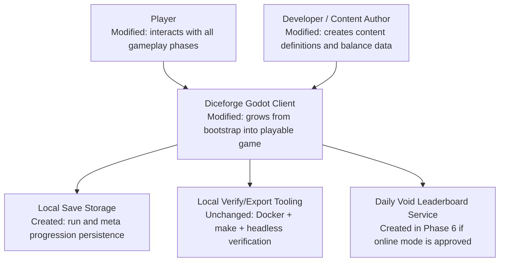
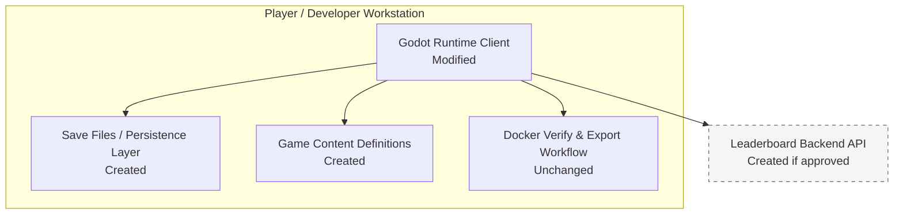
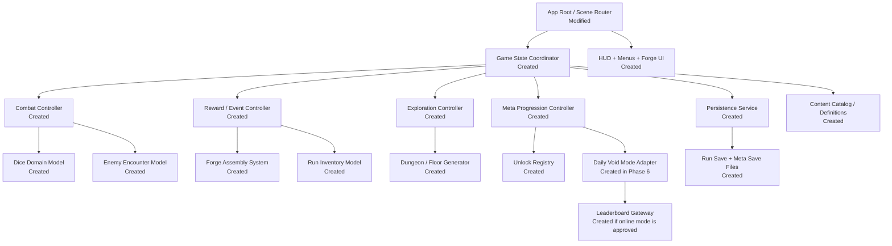

# Architecture: Game Development Phases

## Scope

This design defines the target architecture needed to deliver the six game development phases identified in `docs/research/game-development-phases.md`. The system remains a single-player Godot 4 application with local tooling for verification and export.

## Context Diagram

### Context Notes

- The player interacts only with the Godot client.
- Local save storage is required once run-state and meta-state persistence are introduced.
- Build and export tooling already exists and remains outside gameplay scope.
- The leaderboard service is conditional because the research document identifies it as an unresolved scope question.

## Container Diagram

### Container Notes

- `Godot Runtime Client` is the only gameplay container and owns all runtime orchestration.
- `Save Files / Persistence Layer` covers local run-state checkpoints and permanent progression data.
- `Game Content Definitions` store archetypes, dice parts, enemy kits, encounters, and progression unlock data.
- `Docker Verify & Export Workflow` remains unchanged and continues to validate project integrity.

## Component Diagram

### Component Responsibilities

| Component | State | Responsibility |
|-----------|-------|----------------|
| App Root / Scene Router | Modified | Replaces the bootstrap scene with screen and state routing. |
| Game State Coordinator | Created | Owns phase transitions between menus, exploration, combat, rewards, and progression updates. |
| HUD + Menus + Forge UI | Created | Presents core game state, action choices, rewards, and progression screens. |
| Exploration Controller | Created | Runs room traversal, fog-of-war reveal state, and encounter entry. |
| Combat Controller | Created | Runs dice rolling, action assignment, turn sequencing, enemy turns, and encounter outcomes. |
| Reward / Event Controller | Created | Resolves post-combat rewards, shops, events, and forge entry points. |
| Meta Progression Controller | Created | Awards Echo Shards, unlocks content, tracks achievements, and handles daily mode state. |
| Persistence Service | Created | Saves and restores local run-state and permanent progression. |
| Content Catalog / Definitions | Created | Loads immutable definitions for archetypes, bodies, faces, runes, enemies, floors, and unlocks. |
| Dice Domain Model | Created | Represents die bodies, faces, runes, roll results, and synergy effects. |
| Enemy Encounter Model | Created | Represents enemy actions, AI intent, stats, and boss encounter composition. |
| Forge Assembly System | Created | Applies part swapping and validation rules for die construction. |
| Run Inventory Model | Created | Tracks acquired parts, currencies, action slots, and run modifiers. |
| Dungeon / Floor Generator | Created | Produces room graph, encounter placement, and boss progression structure. |
| Unlock Registry | Created | Stores permanent unlock state and achievement-derived progression. |
| Daily Void Mode Adapter | Created in Phase 6 | Adapts seeded runs and score submission flow for daily challenge mode. |
| Leaderboard Gateway | Created if approved | Sends and retrieves challenge leaderboard data from an external service. |

## Phase-to-Architecture Mapping

| Phase | Components Primarily Introduced |
|-------|---------------------------------|
| 1. Playable Foundation | App Root, Game State Coordinator, HUD shell, Exploration Controller skeleton, Content Catalog seed |
| 2. Core Dice Combat | Combat Controller, Dice Domain Model, Enemy Encounter Model |
| 3. Dice Forging And Run Rewards | Reward Controller, Forge Assembly System, Run Inventory Model |
| 4. Run Structure And Bosses | Dungeon Generator, full Exploration Controller, boss-specific encounter definitions |
| 5. Meta Progression | Persistence Service, Meta Progression Controller, Unlock Registry |
| 6. Advanced Modes And Polish | Daily Void Mode Adapter, Leaderboard Gateway, expanded presentation systems |

## Security Considerations

- All content definitions loaded from disk must be validated before use to avoid invalid runtime state.
- Save files must be treated as untrusted input and validated before deserialization into runtime state.
- If a leaderboard service is added, score submission must avoid trusting arbitrary client claims without validation rules.

## Performance Considerations

- Combat resolution may chain multiple rune and synergy effects; the design keeps effect resolution inside dedicated combat and dice components to contain complexity.
- Dungeon generation and content loading should front-load immutable definitions rather than rebuilding them per encounter.
- UI and animation polish added in later phases must not block deterministic state resolution for combat and seeded daily runs.

## Out of Scope

- Multiplayer or synchronous network play.
- Account systems or cloud save requirements.
- Backend implementation details for leaderboard hosting beyond the gateway contract.
