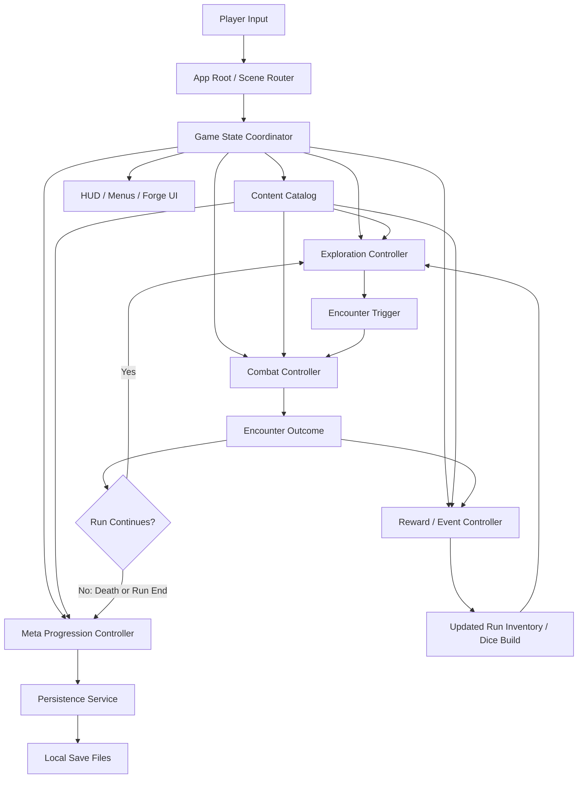
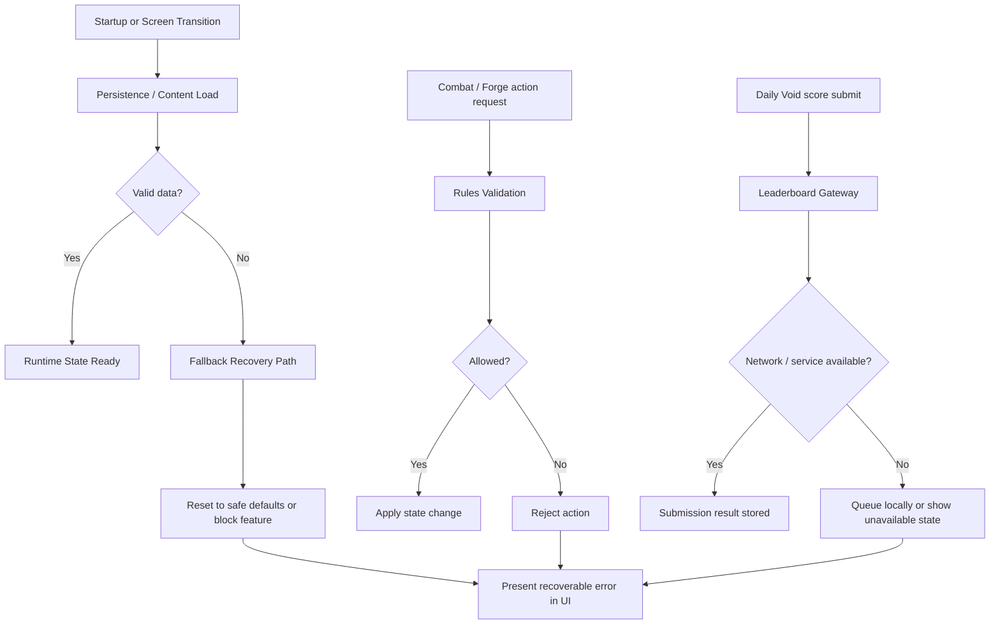

# Data Flow: Game Development Phases

## Overview

This document describes how player input, game content, runtime state, persistence, and optional leaderboard data move through the game across the planned development phases.

## Primary Runtime Flow

## Error and Recovery Flow

## Phase-Specific Data Movement

### Phase 1: Playable Foundation

1. Player input enters through the app root.
2. App root initializes game state and the initial playable scene.
3. Content catalog supplies starter archetype and room shell data.
4. HUD reflects current room, player status, and available actions.

### Phase 2: Core Dice Combat

1. Encounter trigger passes battle context into the combat controller.
2. Combat controller requests active dice and available action slots from run-state.
3. Dice domain model produces roll results and face eligibility.
4. Player action assignments flow back into combat resolution.
5. Enemy encounter model resolves enemy intent and return damage/effects.
6. Encounter outcome updates run-state and sends result to the reward or progression path.

### Phase 3: Dice Forging And Run Rewards

1. Reward controller receives encounter outcome.
2. Reward definitions and event/shop content load from the content catalog.
3. Run inventory model records newly acquired bodies, faces, runes, currencies, and modifiers.
4. Forge UI sends assembly changes to the forge assembly system.
5. Forge assembly system validates allowed body/face/rune combinations, then updates the active dice pool.

### Phase 4: Run Structure And Bosses

1. Dungeon generator produces floor graph, room sequence, and boss destination.
2. Exploration controller tracks visited rooms, fog reveal, and room completion state.
3. Boss encounter data is loaded from content definitions and sent into combat.
4. End-of-run result flows into progression whether the run ends in victory or death.

### Phase 5: Meta Progression

1. Progression controller calculates Echo Shard rewards and achievement outcomes.
2. Unlock registry updates permanent progression state.
3. Persistence service writes meta-state to local storage.
4. Future run-start flow reads unlocked archetypes, bodies, faces, and runes from saved meta-state.

### Phase 6: Advanced Modes And Polish

1. Daily Void mode requests a deterministic seed and mode parameters.
2. The same core runtime systems execute the run with fixed input content.
3. Final score package is sent to the leaderboard gateway if the service exists.
4. Failure to reach the service returns a non-blocking unavailable state without invalidating the local run result.

## Data Stores

| Data Store | Owner | Contents |
|------------|-------|----------|
| Content Catalog | Runtime read model | Definitions for archetypes, bodies, faces, runes, enemies, floors, events, rewards, and unlock rules |
| Run-State Memory | Game State Coordinator | Current room, current floor, active dice, player stats, inventory, rewards, combat state |
| Meta Save Files | Persistence Service | Echo Shards, unlocks, achievements, archetype availability, daily challenge history |
| Optional Leaderboard Service | Leaderboard Gateway | Submitted challenge scores and ranking snapshots |

## Validation Points

- Content definitions validated during load before entering runtime state.
- Save files validated before state hydration.
- Combat commands validated before state mutation.
- Forge mutations validated before accepting dice changes.
- Leaderboard submissions validated before send and after response handling.

## Boundaries

- The build/export toolchain does not participate in gameplay data flow.
- Leaderboard networking is optional and isolated behind a gateway.
- Run-state and meta-state remain separate flows to reduce corruption blast radius.
