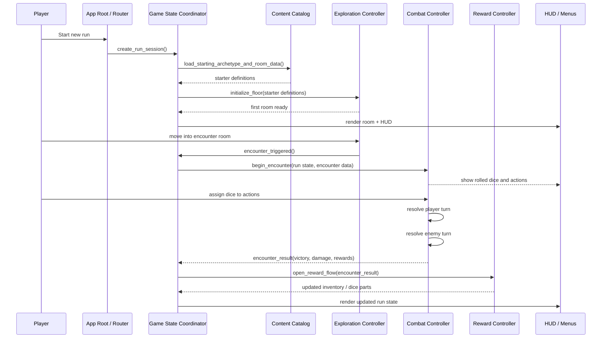
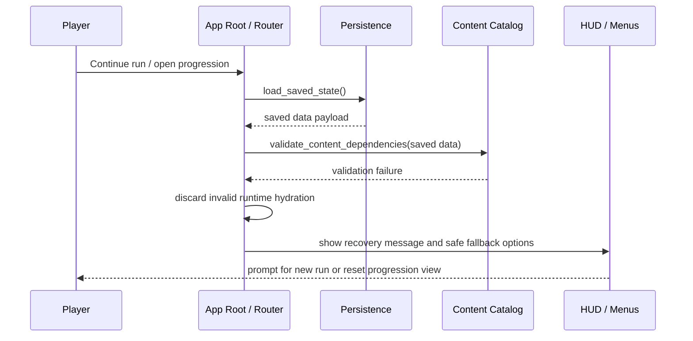
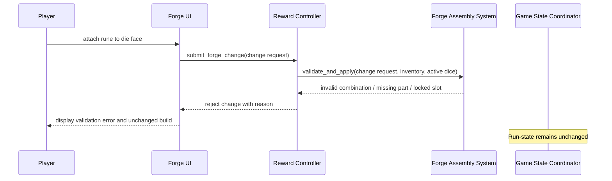
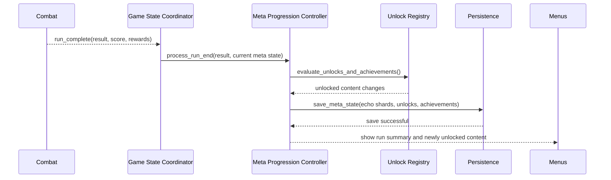
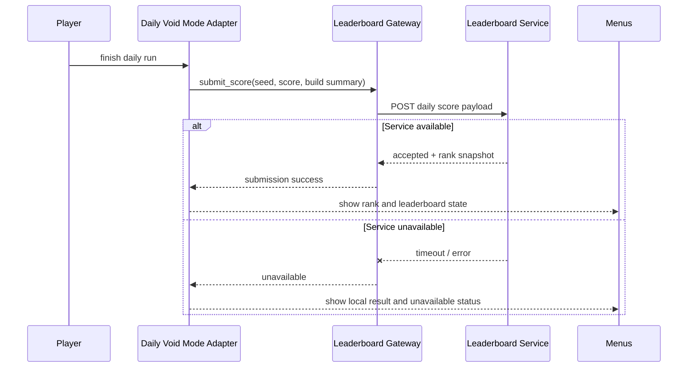

# Sequence Diagrams: Game Development Phases

## 1. Primary Success Scenario: Start Run To First Resolved Encounter

## 2. Error Scenario: Invalid Save Or Content Load At Startup

## 3. Edge Scenario: Invalid Forge Mutation

## 4. End-Of-Run Success Scenario: Death Or Victory To Meta Progression

## 5. External Integration Scenario: Daily Void Score Submission

## Covered Scenarios

- New run initialization and first encounter
- Invalid save or content recovery path
- Invalid forge action rejection
- Run completion and progression persistence
- Optional leaderboard integration success and failure
