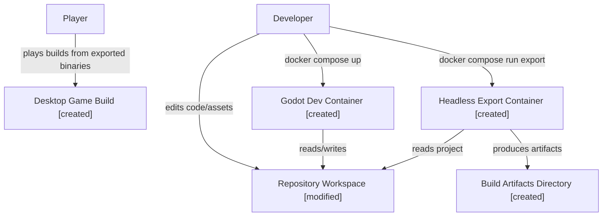
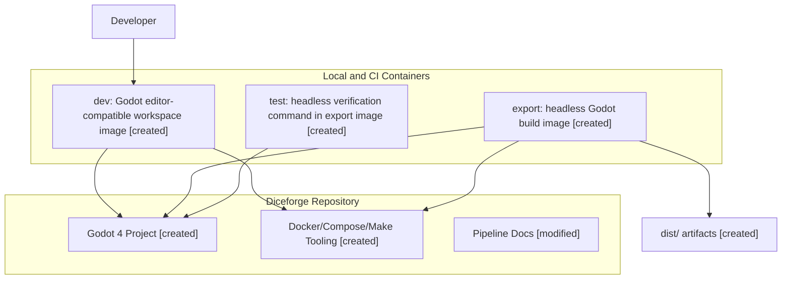
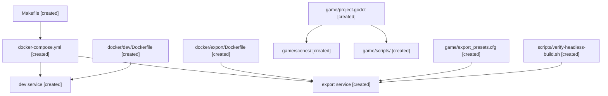

# Architecture Design: Project Initiation

**Ticket:** Define the initial game stack and Docker-based project bootstrapping for the Diceforge prototype
**Date:** 2026-03-21

## Context Diagram

## Container Diagram

## Component Diagram

## Stack Definition

- Engine: Godot 4 LTS-compatible 2D engine
- Scripting language: GDScript for the prototype milestone
- Rendering/gameplay scope: 2D top-down rooms, pixel-art pipeline, deterministic turn-resolution logic
- Source layout root: `game/`
- Build/runtime containerization scope: editor-compatible dev shell, headless export/test image, artifact output under `dist/`
- Initial export targets: Linux desktop first, web export optional but not in the first container milestone

## Responsibilities

- `dev` container:
  - Mount repository workspace
  - Provide a consistent Godot-compatible environment for scripting, scene editing support files, and CLI tooling
  - Run formatting, import generation, and local project checks
- `export` container:
  - Run headless Godot commands
  - Validate the project can load in headless mode
  - Produce export artifacts for CI and local testing
- Godot project:
  - Hold gameplay scenes, scripts, and project settings
  - Keep game logic independent from container-specific paths

## Security Considerations

- Containers mount only the project workspace and generated build directories.
- No secrets are required for the first milestone.
- The initial design excludes external leaderboard or account services, so there is no authentication surface in scope.

## Performance Considerations

- Godot asset import caches should be isolated to mounted project directories to avoid repeated CI import costs.
- Headless exports should be deterministic and scriptable to support CI caching later.
- Desktop-first export keeps the first milestone narrower than multi-target export support.

## Out of Scope

- Multiplayer or networked gameplay
- Cloud save sync
- Online leaderboards backend
- Console export pipeline
- Asset production containers for DCC tools

