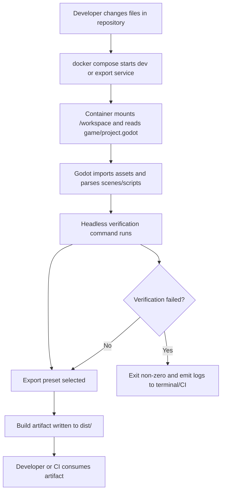

# Data Flow Design: Project Initiation

**Ticket:** Define the initial game stack and Docker-based project bootstrapping for the Diceforge prototype
**Date:** 2026-03-21

## Development and Build Data Flow

## Error Paths

- Missing project files:
  - Container starts, but `game/project.godot` is absent.
  - Verification exits non-zero before export begins.
- Invalid export preset:
  - Headless export command cannot resolve target preset.
  - Build fails without producing `dist/` artifacts.
- Script/scene parse error:
  - Godot parser reports line/scene load failure.
  - Verification blocks export and returns failure output.
- File permission issue on mounted workspace:
  - Container can read project files but cannot write import cache or `dist/`.
  - Export step fails after initialization.

## Data Stores

- Source files: `game/`
- Container definitions: `docker/`, `docker-compose.yml`, `Makefile`
- Generated artifacts: `dist/`
- Temporary import/cache data: container-managed cache directories mounted under the workspace or ephemeral container storage

