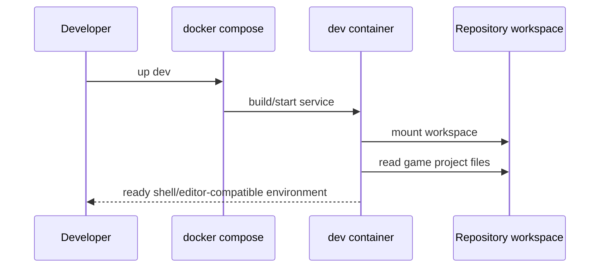
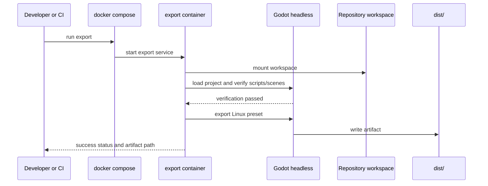
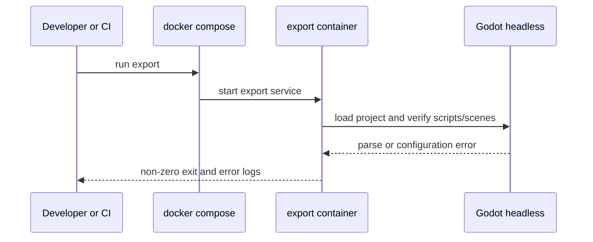

# Sequence Design: Project Initiation

**Ticket:** Define the initial game stack and Docker-based project bootstrapping for the Diceforge prototype
**Date:** 2026-03-21

## Scenario 1: Developer Opens the Project in the Dev Container

## Scenario 2: Headless Build Succeeds

## Scenario 3: Headless Build Fails on Project Validation

