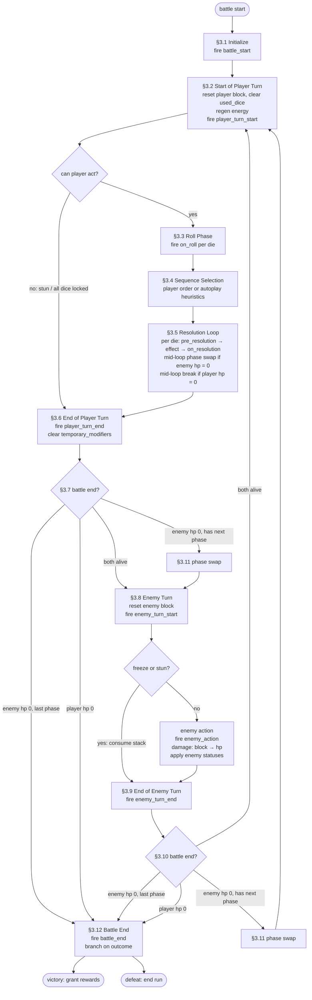

# Combat Algorithm

This document defines a structured combat algorithm for Diceforge as a design reference. It is intended to guide implementation of a fuller dice-builder combat loop than the current prototype rules in [`docs/game-rules.md`](/Users/vcozmulici/workspace/ai/Diceforge/docs/game-rules.md).

## 1. Purpose

The combat system is a turn-based loop where the player rolls a pool of customized dice, chooses the sequence in which those rolled faces resolve, applies rune and core interactions, then survives an enemy response. The algorithm below defines one complete battle from initialization through victory or defeat.

Cores and runes are die-attached effect hooks. Their schemas are defined alongside the rest of the runtime data in §2, and their hook handlers fire at the timing windows enumerated in §4.

## 2. Required Combat State

The combat loop assumes these runtime objects or equivalent data structures exist:

- `Player`
  - `hp`
  - `max_hp`
  - `block`
  - `energy`
  - `energy_regen`
  - `statuses`
  - `dice_pool`
- `Enemy`
  - `hp`
  - `max_hp`
  - `block`
  - `statuses`
  - `ai_pattern`
  - optional `energy`
- `Die`
  - `id`
  - `face_count`
  - `faces`
  - `core` — optional reference to a single equipped `Core`
  - `runes` — list of equipped `Rune` references
  - `statuses`
- `Core`
  - `id`
  - `family` — optional categorization shared with face/rune families (e.g. `attack`, `defense`, `neutral`)
  - `hooks` — map from §4 timing keys to effect descriptors that fire when the host die or its owner reaches that window
- `Rune`
  - `id`
  - `family` — body-compatibility key (e.g. `attack`, `neutral`); must be accepted by the host body's allowed rune families per the prototype rules in [`game-rules.md`](/Users/vcozmulici/workspace/ai/Diceforge/docs/game-rules.md)
  - `hooks` — map from §4 timing keys to effect descriptors that fire when the host die or its owner reaches that window
- `Face`
  - `family` — slot-routing key. One of `attack`, `defense`, `utility`. Determines which action slot or sequencing bucket the face is eligible for, matching the prototype face families in [`game-rules.md`](/Users/vcozmulici/workspace/ai/Diceforge/docs/game-rules.md).
  - `effect` — resolution-behavior key that drives §3.5. One of `damage`, `block`, `heal`, `burn`, `poison`, `freeze`, `reroll`, `amplify`, `utility`. Distinct from `family`: e.g. a `utility`-family face may have `effect = block` (the prototype `Focus`), and an `attack`-family face may have `effect = burn`.
  - `value` — base magnitude or multiplier the effect applies to the rolled value
  - `energy_cost`
  - optional effect metadata (stacks, duration, target rules, etc.)
- `StatusEffect`
  - `id`
  - `stacks`
  - `duration`
  - `timing`
- `BattleState`
  - `turn_index`
  - `phase`
  - `rolled_faces`
  - `resolution_queue`
  - `used_dice` — set of die ids resolved this turn; cleared on the start of each player turn
  - `temporary_modifiers` — list of pending one-shot modifiers (e.g. amplify hooks). Every entry applies to the next qualifying die when fired in §3.5 step 3, and any entry not yet consumed is cleared at end of player turn (§3.6 step 4). All entries in this list are turn-scoped.
  - `outcome`

### 2.1 Clamping Rules

After every modification, the following invariants hold:

- `Player.hp` and `Enemy.hp` are clamped to `[0, max_hp]`. Heals never exceed `max_hp`. Damage cannot drive hp below `0`.
- `Player.block` and `Enemy.block` are clamped to `[0, +infinity)`. Block is never negative; damage absorbed by block reduces it but cannot make it negative.
- `Player.energy` is clamped to `[0, +infinity)`. Spending energy below `0` is rejected; gaining energy is unbounded unless a future schema extension introduces a cap.
- `StatusEffect.stacks` and `StatusEffect.duration` are clamped to `[0, +infinity)`. A status whose `stacks` or `duration` reaches `0` is removed from its owner.

## 3. Battle Flow

The diagram below is a visual map of §3.1 through §3.12. The narrative subsections that follow are the source of truth; the diagram is a navigation aid.



### 3.1 Initialize Battle State

1. Create `Player` and `Enemy` objects with health, statuses, resources, and dice pools.
2. Initialize `block`, `energy`, and transient statuses to zero. Then apply initial modifications from the following sources, in order, with later sources overriding earlier ones on conflict:
   1. archetype passives
   2. equipped cores
   3. rune passives
   4. encounter modifiers
   5. enemy scripts
3. Set `turn_index = 1`.
4. Set `phase = battle_start`.
5. Trigger all `battle_start` timing effects from cores, runes, statuses, and encounter conditions before the first player turn begins. Effects sharing this timing key resolve in the priority order defined in §4.
6. Set `phase = player_turn_start`.

### 3.2 Start of Player Turn

1. Reset player block to zero unless the active rule set or a persistent effect overrides this. This is the only point in the turn cycle where player block is reset.
2. Clear `used_dice`.
3. Increase player energy by `energy_regen`.
4. Set `phase = player_turn_start`. Tick all statuses whose `timing == player_turn_start` on both sides — apply effects, decrement durations, and remove any status whose `stacks` or `duration` has reached `0` per §2.1.
5. Trigger all `player_turn_start` rune, core, and encounter hooks not already covered by status ticks above.
6. Apply automatic effects such as:
   - free rerolls
   - energy gain
   - bonus dice draw
   - temporary face transformation
7. Check player action eligibility. If either condition holds, skip §3.3–§3.5 and proceed directly to §3.6:
   - the player has at least one active `stun` stack that consumes the entire turn
   - every die in the dice pool is locked, exhausted, or otherwise unable to resolve
   When skipping, end-of-turn effects in §3.6 still apply, and the loop still passes through §3.7 before the enemy turn.

### 3.3 Roll Phase

For each die in the player dice pool:

1. Roll a value from `1` to `die.face_count`.
2. Apply core weighting or probability manipulation before finalizing the result.
3. Determine the rolled face and record:
   - die id
   - rolled value
   - resolved face id
   - face family
   - face effect
   - base value
4. Trigger all `on_roll` rune and core hooks for this die.
5. Apply roll-time modifications, such as:
   - double value on even rolls
   - convert damage into burn
   - gain energy on specific symbols
   - add a bonus die
6. Store the final rolled result in `rolled_faces`.

### 3.4 Sequence Selection

If autoplay or AI assistance is active, skip steps 1–2 and build `resolution_queue` directly from §7 heuristics, then persist the result in step 3. Otherwise:

1. Present `rolled_faces` to the player as a resolvable queue.
2. Let the player choose the exact order of resolution.
3. Persist the chosen (or autoplay-built) sequence in `resolution_queue`.

Autoplay heuristics produce a deterministic order, such as:

- setup dice before payoff dice
- amplify before attack
- reroll before expensive effects
- defensive dice before lethal incoming damage

### 3.5 Resolution Loop

For each die result in `resolution_queue`, run all eight steps below. Step 4 dispatches to the **Face resolution table** that follows the list.

1. Check die state restrictions.
   - If locked, skip the die.
   - If exhausted, skip the die.
   - If corrupted, apply the corruption status's defined mutation rule to the face descriptor *before* step 4 executes; the die continues through the loop with the mutated effect.
2. Check energy affordability.
   - If the player has enough energy, continue.
   - If not, either skip the die or apply the design-defined reduced effect.
3. Trigger pre-resolution effects, in order:
   1. Persistent rune and core hooks bound to `pre_resolution` (e.g. duplicate part of the effect, boost the next die). These fire every time their conditions match.
   2. Any matching one-shot entries in `temporary_modifiers` (e.g. amplify hooks set by an earlier `amplify` face). Each matching entry is consumed and removed from `temporary_modifiers` when it fires.
4. Execute the face primary effect using the **Face resolution table** below.
5. Deduct the face energy cost and any additional resource costs.
6. Trigger on-resolution rune, core, and adjacency effects (`on_resolution` timing).
7. Mark the die as used by adding its id to `used_dice`. A die whose id is in `used_dice` cannot be re-resolved for the rest of the turn and cannot be targeted by a subsequent `reroll` face.
8. If the die breaks, exhausts, or is consumed, flag it for removal or disablement (and apply the `exhaust` status from §5 if exhaustion is permanent for the battle).

**Face resolution table** — referenced by step 4, keyed by `face.effect`. The `value` column row notes how `face.value` is interpreted for each effect (see §2 schema).

- `damage` — `value` is a multiplier on rolled value: damage dealt = `rolled_value * value`
  - subtract damage from enemy block first
  - apply remaining damage to enemy hp
- `block` — `value` is a multiplier on rolled value: block gained = `rolled_value * value`
  - add block to the player
- `heal` — `value` is the flat hp gained; rolled value is not consulted unless face metadata overrides this
  - add hp to the player, clamped to `max_hp` per §2.1
- `burn`, `poison`, `freeze` — `value` is the number of stacks added; `duration` is taken from face metadata; rolled value is not consulted by default
  - add stacks and durations to the enemy
- `reroll` — `value` is the maximum number of dice rerolled by this resolution (typically `1`)
  - choose `value` dice from `resolution_queue` whose entries are not in `used_dice`, not exhausted, and not locked
  - the host die currently resolving the reroll cannot be a target
  - reroll each chosen die using roll-phase logic for that die only, producing a new face result
  - replace each chosen die's entry in `rolled_faces` and `resolution_queue` at the same position with the new face result; do not re-prompt the player to reorder
  - record both the original and replacement results in the battle log so the reroll is auditable
  - rerolled dice remain unresolved and are handled when their positions are reached in the queue
- `amplify` — `value` is the additive or multiplicative bonus stored in the modifier entry (interpretation per face metadata)
  - append a modifier entry to `temporary_modifiers`, scoped to the next qualifying die
  - the modifier is consumed when step 3 fires it on a subsequent die, or cleared per §3.6 if no qualifying die resolves
- `utility` — `value` is utility-defined; effect-specific metadata governs interpretation
  - resolve its defined effect, such as draw, duplicate, steal, transform, or cleanse
  - **Note on duplicate:** "duplicate" operates on the resolved output of a target die (e.g. cloning damage), not by re-iterating the host die's entry through §3.5. A duplicated output does not add a new entry to `resolution_queue` and does not block on `used_dice`.

**Mid-loop phase transitions.** After step 4 of any die's resolution, if `Enemy.hp` has reached `0` and the enemy has another phase per §3.11, dispatch §3.11 immediately and resume the loop with the next die in `resolution_queue` against the new phase's state. If the enemy has no more phases, the loop continues — subsequent damage clamps at `0` per §2.1 and §3.7 will detect victory at the end of the player turn. The same rule applies to `Player.hp`: if it reaches `0` mid-loop, finish the current die's steps 5–8 and break out of the resolution loop; §3.7 will detect defeat. Mid-loop exits do not skip §3.6 (end-of-player-turn effects); they fall through to §3.6 with `resolution_queue` partially consumed.

### 3.6 End of Player Turn

1. Set `phase = player_turn_end`. Tick all statuses whose `timing == player_turn_end` on both sides (e.g. enemy burn/poison ticks declared with this timing key, player regeneration, player self-damage, curse escalation, delayed detonations). Each status ticks exactly once per round at exactly the timing window declared in its `timing` field — `player_turn_end` ticks here, `enemy_turn_end` ticks in §3.9.
2. Trigger all `player_turn_end` rune, core, and encounter hooks not already covered by status ticks above.
3. Apply fatigue, overload, or overuse penalties if usage thresholds were exceeded.
4. Clear all entries in `temporary_modifiers` (including unspent `amplify` hooks). Remove temporary one-turn modifiers from dice, faces, and player buffs.

Player block is not reset here. Block built during the player turn persists through the enemy turn so it can absorb incoming damage, and is reset at the start of the next player turn (§3.2).

### 3.7 Check for Battle End After Player Turn

End-of-turn effects in §3.6 (and any mid-loop deaths from §3.5) can drive either side to zero hp. Evaluate the branches in order:

1. If `Enemy.hp <= 0`, run §3.11 (Enemy Phase Transitions).
   - If a new phase activates, advance to enemy turn (§3.8).
   - Otherwise set `outcome = victory` and exit the combat loop to §3.12.
2. Else if `Player.hp <= 0`, set `outcome = defeat` and exit the combat loop to §3.12.
3. Otherwise advance to enemy turn (§3.8).

If both sides reach zero on the same step, branch 1 is evaluated first, so a phase transition or victory takes precedence over defeat.

### 3.8 Enemy Turn

1. Reset `Enemy.block` to zero unless the active rule set or a persistent effect overrides this. This mirrors the player block reset in §3.2 and is the only point in the turn cycle where enemy block is reset; block built by enemy actions persists through the next player turn so it can absorb player damage.
2. Set `phase = enemy_turn_start`. Trigger all `enemy_turn_start` hooks (including any statuses whose `timing == enemy_turn_start`).
3. Check skip conditions. `freeze` and `stun` use `enemy_turn_start` as their `timing` and tick exactly here — not again in §3.9 — to avoid double-decrement:
   - if the enemy has at least one `freeze` or `stun` stack, consume one stack, skip steps 4–8, and proceed to §3.9.
4. Set `phase = enemy_action`. Select an action from `Enemy.ai_pattern` or scripted turn table; optionally spend `Enemy.energy` if the encounter uses an enemy energy system.
5. Trigger `enemy_action` hooks before damage application.
6. Resolve enemy action types, such as:
   - direct damage
   - multi-hit attacks (each sub-hit applies block-then-hp ordering independently per step 7)
   - debuffs
   - dice locks
   - face corruption
   - value inversion
   - summons
7. For each damage component the action delivers, apply damage to `Player.block` first, then to `Player.hp`. Multi-hit attacks repeat this for each sub-hit so block can be eroded mid-action.
8. Apply enemy statuses to the player or dice where defined.

### 3.9 End of Enemy Turn

1. Set `phase = enemy_turn_end`. Tick all statuses whose `timing == enemy_turn_end` on both sides — apply effects, decrement durations, and remove any status whose `stacks` or `duration` has reached `0` per §2.1. `freeze` and `stun` are not ticked here (they tick at `enemy_turn_start` per §3.8).
2. Trigger all `enemy_turn_end` rune, core, and encounter hooks not already covered by status ticks above.

Statuses that gate die behavior (`lock`, `exhaust`, `corrupt`) and other temporary face changes are removed automatically by the §2.1 invariant when their `duration` ticks to `0` during step 1; no separate "unlock" or "revert" step is needed.

### 3.10 Check for Battle End After Enemy Turn

End-of-turn effects in §3.9 (and damage taken during §3.8) can drive either side to zero hp. Evaluate the branches in order:

1. If `Enemy.hp <= 0`, run §3.11 (Enemy Phase Transitions).
   - If a new phase activates, increment `turn_index` and return to §3.2.
   - Otherwise set `outcome = victory` and exit the combat loop to §3.12.
2. Else if `Player.hp <= 0`, set `outcome = defeat` and exit the combat loop to §3.12.
3. Otherwise increment `turn_index` and return to §3.2.

If both sides reach zero on the same step, branch 1 is evaluated first, so a phase transition or victory takes precedence over defeat.

### 3.11 Enemy Phase Transitions

Multi-phase enemies (e.g. the prototype `Shard Overseer` and `Final Warden`) define an ordered list of phases, each with its own `hp`, `max_hp`, `block`, `statuses`, and `ai_pattern`. When a battle-end check (§3.7 or §3.10) finds enemy hp at or below zero, the system must check for additional phases before declaring victory.

1. If the enemy has no remaining phases beyond the current one, declare victory and exit per the calling check.
2. If the enemy has another phase, do not exit the loop. Instead:
   1. Trigger all `phase_end` hooks of the current phase (status cleanups, scripted reactions, log entry).
   2. Swap in the next phase definition: replace `hp`, `max_hp`, `block`, `statuses`, and `ai_pattern` with the new phase's values. Phase swaps are not a heal — the new phase declares its own hp and is not derived from the old one.
   3. Trigger all `phase_start` hooks of the new phase. `battle_start` does not refire on phase transitions; `phase_start` is a separate timing key per §4 and is the only hook that fires here.
   4. Return control to the calling check, which proceeds to its "continue" branch (enemy turn after §3.7, or next player turn after §3.10).

Status effects from the previous phase are retained on the enemy unless the incoming phase definition explicitly clears them. Player-side state (block, energy, statuses, dice) is unaffected by a phase transition.

Damage that drove the previous phase below `0` hp does not carry over into the new phase. The new phase always starts at the hp value declared in its phase definition, regardless of how much overflow damage was dealt to phase-end hp. Subsequent dice or actions resolve against the new phase's full state.

### 3.12 Battle End

On exit from the combat loop:

1. Set `phase = battle_end`.
2. Trigger all `battle_end` timing effects from cores, runes, statuses, and encounter conditions, in the priority order defined in §4.
3. Branch on `outcome`:
   - **if `outcome == victory`:**
     - grant rewards as defined in [`game-rules.md` §7](/Users/vcozmulici/workspace/ai/Diceforge/docs/game-rules.md)
     - progress to the next room or encounter result step
     - persist run-state changes
   - **else if `outcome == defeat`:**
     - end the run
     - calculate meta-progression rewards
     - persist unlocks, experience, or currency as applicable

`battle_end` hooks fire before reward processing so they can modify what is granted (e.g. an "on victory, +50% rewards" core) but cannot re-enter the combat loop.

## 4. Effect Timing Rules

Every effect should declare a timing window so interactions stay deterministic. Recommended timing keys:

- `battle_start` — fired once in §3.1 step 5
- `player_turn_start` — fired in §3.2
- `on_roll` — fired per die in §3.3 step 4
- `pre_resolution` — fired per die in §3.5 step 3
- `on_resolution` — fired per die in §3.5 step 6
- `player_turn_end` — fired in §3.6
- `enemy_turn_start` — fired in §3.8 step 1; freeze/stun tick at this window
- `enemy_action` — fired in §3.8 step 4
- `enemy_turn_end` — fired in §3.9
- `phase_end` — fired in §3.11 step 2.1 when an enemy phase ends
- `phase_start` — fired in §3.11 step 2.3 when a new enemy phase activates (this is per-phase; `battle_start` does not refire on phase transitions)
- `battle_end` — fired in §3.12 step 2 before reward processing

If multiple effects share the same timing:

1. resolve passive stat modifiers first
2. resolve mandatory triggered effects second
3. resolve optional player-directed effects last

## 5. Status Rules

Statuses should use one consistent structure:

- `stacks` for intensity
- `duration` for lifetime
- `timing` for when it ticks

Recommended baseline interpretations:

- `burn`
  - deals damage when its timing window triggers
- `poison`
  - deals damage and may decay by stack or duration
- `freeze`
  - delays or skips enemy actions
- `stun`
  - prevents one action or one full turn
- `fatigue`
  - lowers future energy or die quality
- `lock`
  - prevents a die from resolving for the duration of the status
- `exhaust`
  - marks a die as unusable for the remainder of the battle; referenced by §3.5 step 1 and the `reroll` targeting rules
- `corrupt`
  - declares a per-resolution mutation rule applied at §3.5 step 1; the underlying face descriptor is not modified, so when the corrupt status's `duration` reaches `0` and the status is removed per §2.1, no explicit revert step is needed

## 6. Determinism Rules

Implementation should preserve deterministic combat where possible.

- Use explicit phase transitions.
- Record the exact rolled results before player ordering.
- Record the exact `resolution_queue`.
- Do not allow hidden random rolls during resolution without logging them.
- If rerolls occur, record both original and replacement results.
- Separate permanent run-state mutation from temporary battle-state mutation.

### 6.1 Battle Log Record Format

Every roll, resolution, enemy action, status tick, and phase transition should produce one log entry. A canonical entry includes at least:

```
{
  turn: 1,                            // BattleState.turn_index at the time of the entry
  step_index: 17,                     // monotonic across the entire battle, starting at 0 in §3.1; never resets per turn
  step_kind: "resolution",            // roll | resolution | enemy_action | status_tick | phase_transition | battle_start | battle_end
  die_id: "d_strike_01",              // null for non-die steps
  rolled_value: 5,                    // null for non-roll steps
  resolved_face: "Strike",
  family: "attack",
  effect: "damage",
  base_value: 10,                     // value before modifiers
  modifiers_applied: ["amplify+2"],   // names or ids of modifiers consumed during this step
  outcome: "12 damage applied to enemy_block, 0 spillover to enemy_hp",
  rerolled_from: null                 // populated on reroll replacements with the prior entry's step_index
}
```

`step_index` is monotonic across the battle so a reroll replacement can reference its prior entry unambiguously via `rerolled_from`. This is a recommended baseline, not a wire format — implementations may extend the schema as long as every random outcome and every state change is reconstructable from the log.

## 7. Autoplay Heuristic Baseline

If the game resolves combat without direct player input, use this priority order:

1. free setup effects
2. rerolls that can improve unresolved dice
3. amplify and duplication effects
4. cleanse or survival utility if lethal damage is threatened
5. block if survival is uncertain
6. attack and damage-over-time application
7. low-impact utility last

This keeps autoplay legible and avoids wasting setup dice after payoff dice have already resolved.

## 8. Implementation Notes

The combat loop is easiest to implement if the system separates:

- battle state
- die definitions
- face effects
- rune hooks
- core hooks
- status ticking
- enemy action scripting

A practical engine boundary is:

- `CombatController`
  - owns battle phases and transitions
- `DiceResolver`
  - owns rolling, rerolling, and face lookup
- `EffectResolver`
  - owns face, rune, core, and status execution
- `EnemyAI`
  - selects enemy actions
- `BattleLog`
  - records every roll and resolution step for debugging and UI

## 9. Relationship to Current Prototype

This document is a target combat specification, not a claim that every rule here is already implemented in the repository today.

Compared with the current prototype:

- it adds explicit start-of-turn and end-of-turn effect windows
- it adds ordered player-controlled die sequencing
- it adds richer status and resource handling
- it adds rune/core timing hooks beyond the current simplified combat flow
- it defines a fuller enemy action model for future encounters
